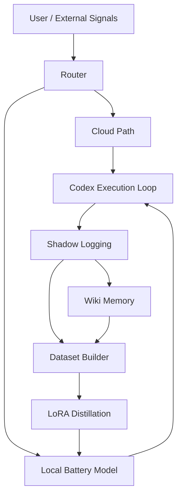

# System Architecture Appendix V1

## Source
- Path: `en/system-architecture-appendix-v1.md`
- Language: `en`
- Section: `en`
- Original file: [en/system-architecture-appendix-v1.md](C:/Users/yh-PC-003/Desktop/codex/lume/docs/en/system-architecture-appendix-v1.md)

## Body

# System Architecture Appendix V1

This appendix summarizes the `Lume` execution loop and module boundaries.

## Module Roles

- `Router`: decide cloud, local, or mixed execution
- `Codex Execution Loop`: perform edits, tools, and deliveries
- `Shadow Logging`: preserve observable runtime traces
- `Wiki Memory`: turn tasks into structured long-term knowledge
- `Dataset Builder`: convert logs into trainable records
- `LoRA Distillation`: update the local adapter path

