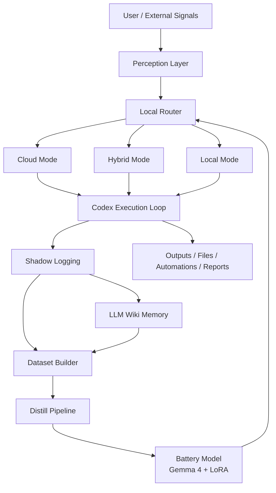
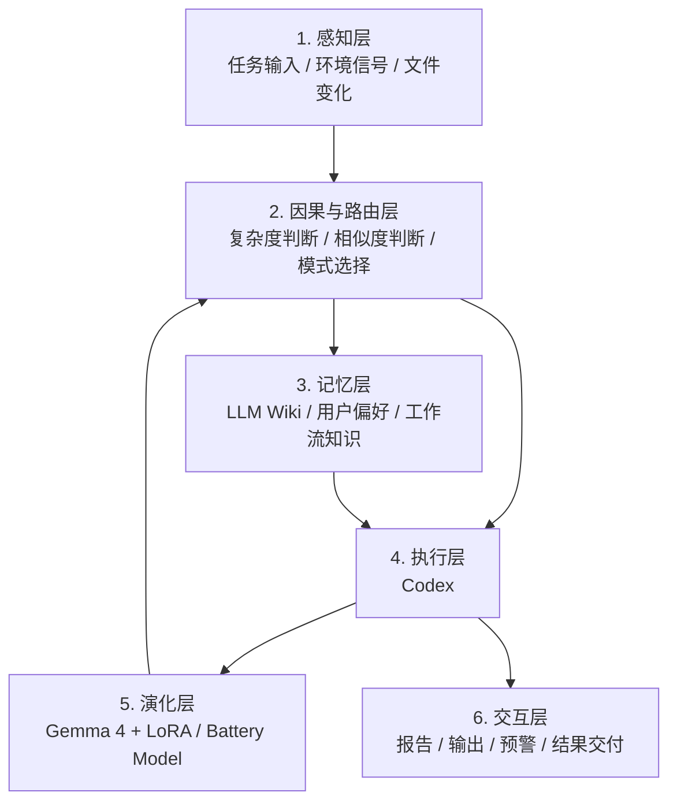
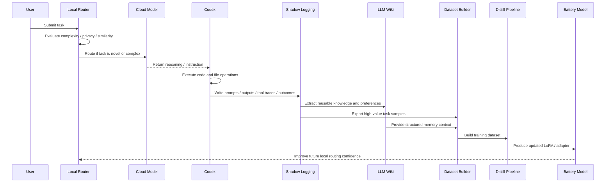
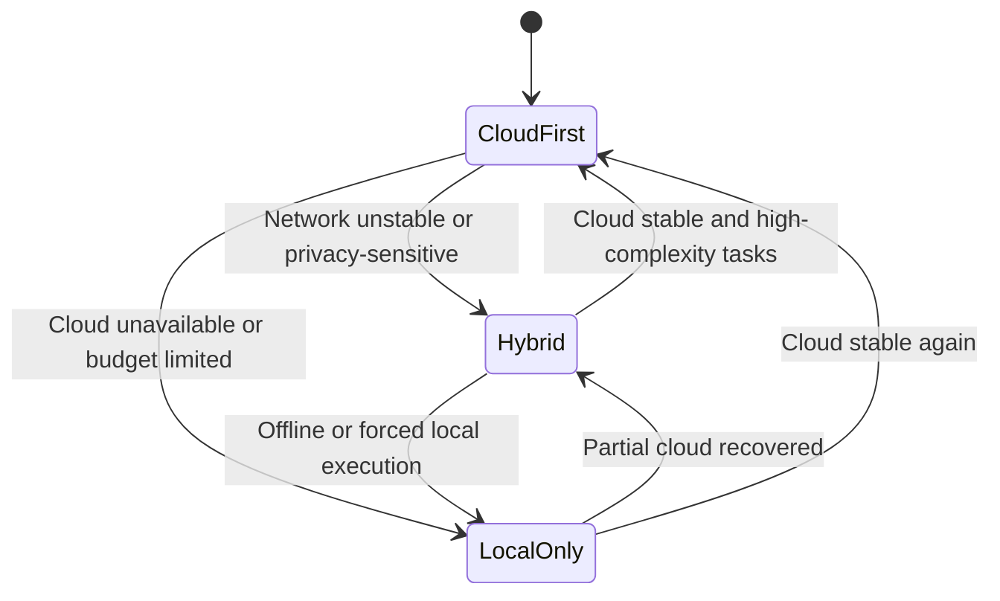
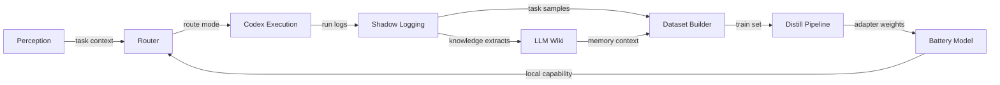
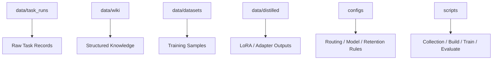
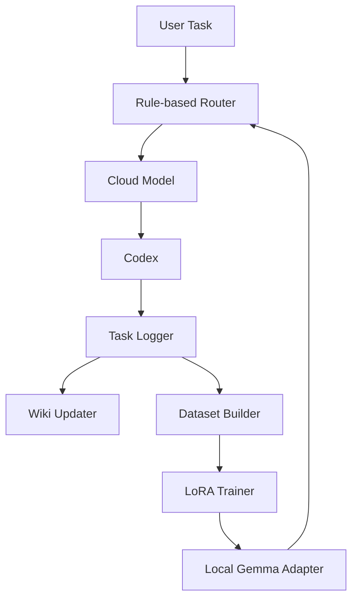

# Lume Sentinel 2026 系统架构图附录 V1

## Source
- Path: `system-architecture-appendix-v1.md`
- Language: `mixed`
- Section: `root`
- Original file: [system-architecture-appendix-v1.md](C:/Users/yh-PC-003/Desktop/codex/lume/docs/system-architecture-appendix-v1.md)

## Body

# Lume Sentinel 2026 系统架构图附录 V1

## 1. 文档定位

本文档作为以下两份主文档的图示附录：

- `whitepaper-v1.md`
- `implementation-plan-v1.md`

目标是将 `Lume Sentinel 2026` 的核心模块、职责边界、主数据流和运行模式，用结构图方式表达清楚，便于后续工程实现、沟通和迭代。

## 2. 总体架构图

下面的图展示了 `Lume Sentinel V1` 的总体闭环。

### 图解说明

- `Perception Layer` 负责接收用户任务与环境信号
- `Local Router` 负责判断任务走云端、本地还是混合模式
- `Codex Execution Loop` 是统一执行中枢
- `Shadow Logging` 负责沉淀任务轨迹
- `LLM Wiki Memory` 负责沉淀结构化知识
- `Dataset Builder` 负责从日志和记忆中提炼训练样本
- `Distill Pipeline` 负责将样本蒸馏为本地适配器
- `Battery Model` 负责在后续任务中提供低成本、本地可继承能力

## 3. 六层演化栈结构图

### 六层说明

**1. 感知层**

- 输入用户请求
- 输入任务上下文
- 输入文件和系统环境变化
- 为路由层和执行层提供原始信号

**2. 因果与路由层**

- 判断任务复杂度
- 判断任务是否适合本地复用
- 识别是否需要联网能力
- 输出模式选择结果

**3. 记忆层**

- 存储用户偏好
- 存储项目背景
- 存储成功工作流和失败经验
- 为执行层提供长期上下文

**4. 执行层**

- 由 `Codex` 承担
- 负责代码、脚本、文件和自动化操作
- 将系统判断转化为实际资产

**5. 演化层**

- 由 `Gemma 4 + LoRA` 组成
- 接收蒸馏流水线产物
- 在后续任务中反哺本地能力

**6. 交互层**

- 输出结果、报告和建议
- 以低焦虑方式呈现系统行动与判断

## 4. 任务执行数据流图

下面的图展示一次高价值任务如何被转化为长期资产。

### 数据流核心结论

- 高价值任务不是结束于输出，而是进入资产沉淀流程
- `Codex` 是执行与资产化之间的关键桥梁
- 本地模型能力的提升依赖日志、记忆和数据集共同驱动
- 路由器应随着本地模型进步而调整决策边界

## 5. 三态运行模式图

### 模式定义

**Cloud-First**

- 适用于复杂、陌生、高价值任务
- 优先追求能力上限
- 同时进行影子记录

**Hybrid**

- 适用于隐私敏感、网络波动、需要成本平衡的任务
- 云端负责复杂推理，本地负责辅助和部分执行

**Local-Only**

- 适用于断网、预算受限或明确要求本地运行的情形
- 由电池模型接管主要理解和轻量推理任务

## 6. 模块边界图

下面的图强调各模块之间的输入输出边界。

### 边界原则

- `Router` 只做决策，不直接持久化知识
- `Codex Execution` 只负责执行，不负责训练
- `Shadow Logging` 负责原始沉淀，不直接做复杂推理
- `LLM Wiki` 负责知识组织，不负责训练调参
- `Dataset Builder` 负责样本提炼，不直接决定执行策略
- `Distill Pipeline` 负责训练，不负责任务编排
- `Battery Model` 负责本地接管，不直接修改历史日志

## 7. 存储结构图

### 存储层职责

- `task_runs` 保存任务级原始资产
- `wiki` 保存长期可读知识资产
- `datasets` 保存训练资产
- `distilled` 保存模型增量资产
- `configs` 保存策略资产
- `scripts` 保存流程自动化资产

## 8. V1 最小可运行架构

如果需要以最小成本启动 `V1`，建议先实现如下最小架构：

### 最小架构特点

- 不依赖复杂前端
- 不依赖复杂因果发现模型
- 优先证明“记录 -> 沉淀 -> 蒸馏 -> 复用”的闭环
- 一旦闭环稳定，再逐步扩展高级预测与多模态能力

## 9. 推荐阅读顺序

如果后续有人进入项目，建议按以下顺序阅读：

1. `whitepaper-v1.md`
2. `implementation-plan-v1.md`
3. `system-architecture-appendix-v1.md`

这样能先理解愿景，再理解模块，再理解图示结构。

## 10. 一句话总结

`系统架构图附录 V1` 的作用，是把 `Lume Sentinel` 从概念方案压缩成清晰的工程地图，让每个模块知道自己接什么、产出什么，以及如何共同形成 Token 资产化闭环。

