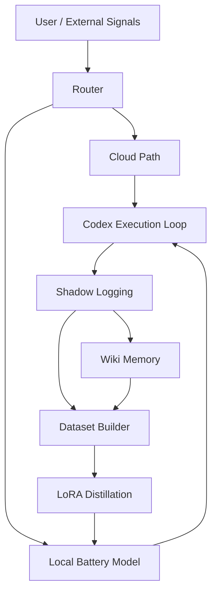
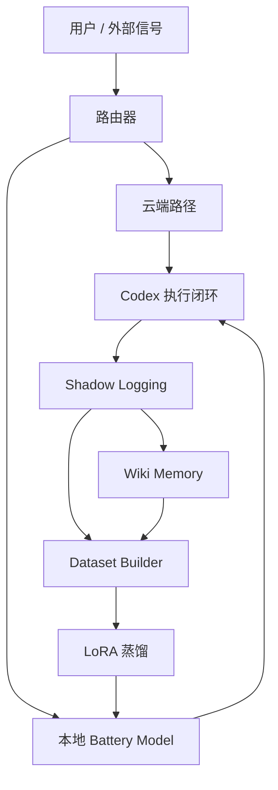

# System Architecture Appendix V1

## English

This appendix summarizes the `Lume` execution loop and module boundaries.

### Module Roles

- `Router`: decide cloud, local, or mixed execution
- `Codex Execution Loop`: perform edits, tools, and deliveries
- `Shadow Logging`: preserve observable runtime traces
- `Wiki Memory`: turn tasks into structured long-term knowledge
- `Dataset Builder`: convert logs into trainable records
- `LoRA Distillation`: update the local adapter path

## 中文

本文附录用于总结 `Lume` 的执行闭环和模块边界。

### 模块职责

- `Router`：决定任务走云端、本地还是混合路径
- `Codex Execution Loop`：负责编辑、工具调用与实际交付
- `Shadow Logging`：保存可观测运行轨迹
- `Wiki Memory`：把任务沉淀为结构化长期知识
- `Dataset Builder`：把日志转成可训练记录
- `LoRA Distillation`：更新本地适配器路径
