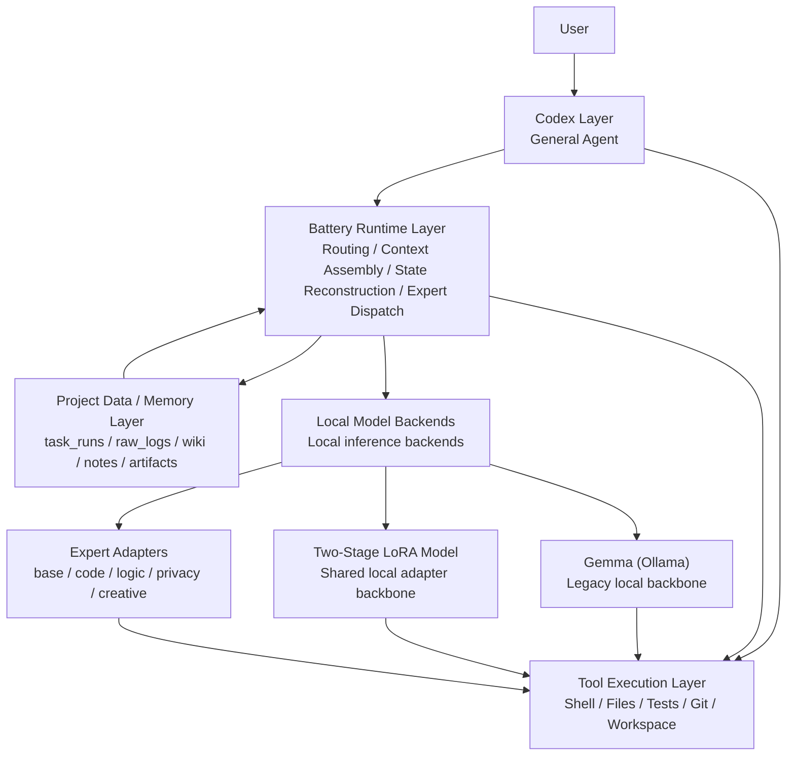

# Battery Runtime Boundary and Strategy

## Summary
This page captures the current working judgment on what Battery is, what it is not, where Gemma and LoRA fit, why Battery should not be treated as a second Codex-like agent, and which technical directions should be kept, cut, or reduced to a minimal viable runtime strategy.

## What Battery Is
- Battery should be defined as a project-specific local runtime layer, not as the primary agent.
- Battery is responsible for routing, context assembly, local memory access, task-state reconstruction, expert dispatch, and local/cloud/hybrid policy decisions.
- Battery is most valuable when it turns a strong general agent into a project-aware local work system.

## What Battery Is Not
- Battery should not be positioned as a second general-purpose coding agent.
- Battery should not try to replace Codex at task planning, broad tool use, or general software execution.
- Battery should not be treated as identical to Gemma, because Gemma is only one local model backend Battery can call.
- Battery should not be treated as identical to LoRA, because LoRA is only one parameter adaptation mechanism inside the local model stack.

## Layering Model

## Layer Responsibilities

### Codex Layer
- Understands the current user request.
- Reads and edits code.
- Runs tools and advances the task.
- Acts as the primary general-purpose agent.

### Battery Runtime Layer
- Decides whether work should go local, hybrid, or cloud.
- Reconstructs the current task site from project memory.
- Injects the most relevant local context for the active task.
- Selects a local model backend when one should be used.
- Applies project-specific constraints around privacy, cost, and control.

### Project Data / Memory Layer
- Stores task runs, raw logs, wiki pages, notes, artifacts, and historical outcomes.
- Preserves project-specific operational memory.
- Supplies retrieval material for Battery, but does not make decisions by itself.

### Tool Execution Layer
- Runs shell commands, tests, file operations, Git commands, and local programs.
- Executes actions requested by Codex or by Battery-mediated workflows.
- Does not own high-level strategy.

## Where Gemma Fits
- Gemma belongs under local model backends, not in the Codex layer.
- In the current repository, the legacy Battery strategy uses `gemma4:31b` through Ollama as the primary local model backend.
- The relationship is `Battery uses Gemma`, not `Battery equals Gemma`.

## Where LoRA Fits
- LoRA is a parameter adaptation mechanism inside the local model backend layer.
- Two-stage LoRA currently acts as a shared local adapter backbone.
- Expert adapters are a further split of that same local adaptation idea.
- LoRA should be understood as a component, not as the full Battery strategy.

## Why Battery Should Not Be a Second Agent
- If Battery is pushed into full task planning, long-horizon tool use, and autonomous execution, it becomes a weaker duplicate of Codex.
- The strongest distinction is to let Codex remain the actor while Battery provides the project-specific runtime substrate.
- Battery is most defensible as local memory, routing, context assembly, and project policy.

## Battery's Real Uniqueness
- Local long-term memory over project-specific history.
- Project-private routing decisions for local, hybrid, and cloud execution.
- Reconstruction of task state from prior notes, artifacts, tool traces, and outcomes.
- Conversion of team-specific experience into reusable runtime context.
- Stronger user control over privacy, retention, and execution policy.

## Current Technical Judgment
- The overall direction remains reasonable.
- The architecture is more promising when Battery is treated as a runtime substrate than when it is treated as a competing agent.
- The current implementation proves some useful local improvements, but it does not yet prove that the new Battery strategy is stronger than the legacy one in aggregate.

## What Should Be Kept
- High-state-density battery dataset construction.
- Two-stage training instead of one flat mixed training pass.
- Continue-task-specific optimization, because this is the clearest improvement area so far.
- Real task-shaped evaluation instead of relying only on training loss.
- Routing and readiness ideas as part of the runtime layer.

## What Should Be Cut or Paused
- Treating the current multi-expert adapters as ready for primary runtime takeover.
- Expanding the expert taxonomy before the first generation path is stable.
- Using the same generation style for continue, patch, and log tasks.
- Treating the current small local base model as the final battery carrier.

## Reassessment of LoRA
- LoRA should be retained, but not treated as the main answer.
- LoRA has shown value in domain alignment and especially in continue-task behavior shaping.
- LoRA has not yet shown that a LoRA-first Battery runtime beats the old Gemma-backed strategy overall.
- The correct role for LoRA is local capability injection, not full runtime substitution.

## Alternatives If LoRA Is Not the Main Axis
- Runtime-first strategy: improve routing, dispatch, and policy before adding more adapters.
- Context engineering: assemble better task-state prompts at inference time.
- Retrieval and memory augmentation: use task runs, notes, logs, and wiki memory as live retrieval assets instead of relying mainly on parameter memory.
- Lightweight preference optimization: use ranking and selection to improve behavioral choices without assuming large parameter shifts are the primary solution.

## Most Promising Non-LoRA-First Direction
- Make Battery a smarter runtime system.
- Prioritize better routing, better context feeding, and better retrieval of historical task experience.
- Use local models as backends selected by Battery, not as the definition of Battery itself.

## Minimal Viable Battery Strategy
- Keep the old Gemma-backed Battery as the primary baseline runtime.
- Keep one shared two-stage local adapter as an optional local backbone.
- Keep one continue-specialized enhancement path because continue is the clearest local gain area.
- Use simple routing:
- Continue-like tasks may use the specialized local path.
- Patch and log tasks remain on the legacy path until local outputs stabilize.
- Expand only after the new path beats or at least matches the old path on real task evaluations.

## Current Evaluation Takeaway
- The newest expert-adapter runtime benchmark still trails the old strategy overall.
- Continue tasks are the one clear area where the new path shows promise.
- Patch and log behavior remain weaker under the new path.
- This means the project should continue with a runtime-centered Battery strategy, but the current expert-adapter path should stay experimental.

## Decision Boundary
- Battery should be built as a runtime and memory substrate under Codex, not as a competing general agent.
- Gemma, two-stage LoRA, and expert adapters all belong in the local backend layer controlled by Battery.
- The next mature version of Battery should be judged by how well it reconstructs task state, routes work, and improves task continuation, not by whether it impersonates a second Codex.
